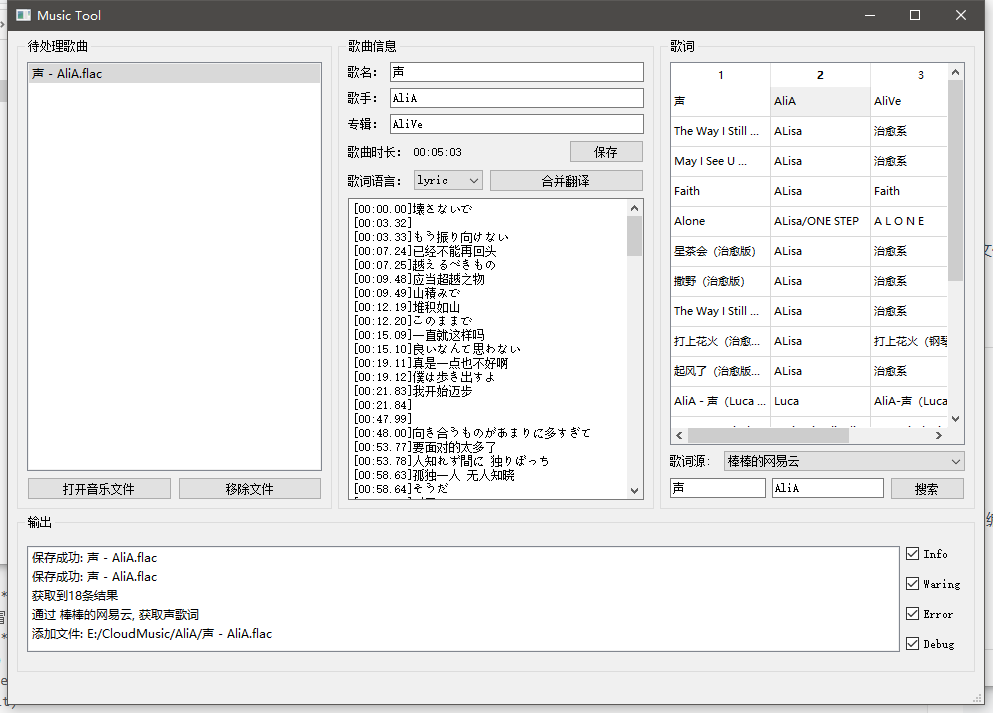

# LrcInlineTool



# 运行

+ 直接运行`main.py`文件
+ 运行现成的发布版本

## 依赖

`pip3 install -r requirement.txt` 即可正常使用

代码基于`PyQt5`，需要依赖以下库

+ `pip3 install PyQt5`

+ `pip3 install mutagen` (用于支持修改音乐文件标签)

  如果想要修改`.ui文件`则需要安装下面的工具，使用`designer.exe`编辑`ui文件`

+ `pip3 install PyQt5-tools`

## 打包成exe

*windows*

+ `pip install pyinstaller`
+ `cd`到项目目录
+ `mkdir dist`
+ `pyinstaller -w -F main.py --distpath dist  --specpath dist`
+ 应该会有一个单文件在`dist`目录 （`qt`打包出来的是真的大）

## 重新生成界面代码

+ 运行`ui/gen_py.bat`即可
+ `Linux`运行等效命令即可


# API

## 网易云

参考：[网易云音乐的API - 知乎 (zhihu.com)](https://www.zhihu.com/column/p/21326015?utm_medium=social&utm_source=weibo)

### 搜索歌曲 (获取歌曲id)

`http://music.163.com/api/search/get/web?s=声&type=1&offset=0&total=true&limit=60`

### 获取歌词

`http://music.163.com/api/song/lyric?id=424057340&lv=-1&kv=-1&tv=-1`


## mutagen

https://mutagen.readthedocs.io/en/latest/

mp3是用的ID3保存的标签

### 基础信息

```Python
import mutagen
mutagen.File('1.mp3')			# 返回一个类似于字典的结构，用法一样
mutagen.File('1.mp3').keys() 	# 返回所有的标签名字
mutagen.File('1.mp3')['TIT2']	# 访问标签对应的数据
```


## TODO

- [ ] 优化歌词搜索，防止找不到翻唱
- [x] 歌词搜索如果出现`&`则会截断
- [ ] 支持递归查找歌曲
- [x] 新的歌词格式 
- [x] 歌词列表显示专辑
